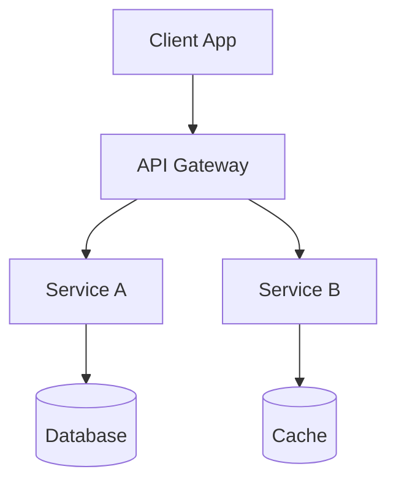

# Architecture Design - Avanade Method

You are executing the **Architecture Design workflow** following Avanade Method standards.

## Elicitation Phase

Before creating the architecture document, gather:

**1. System Context**
- What type of system? (API, Web App, Microservices, etc.)
- What is the expected scale? (users, transactions/sec)
- Cloud or on-premises? Azure preferred?

**2. Quality Attributes (non-functional)**
- Performance requirements
- Availability/SLA targets
- Security classification (public, internal, confidential)
- Compliance requirements (LGPD, SOC2, etc.)

**3. Constraints**
- Technology constraints (existing stack, languages)
- Budget constraints
- Timeline pressures
- Team skill set

**4. Integration Points**
- External systems to integrate
- Existing services to reuse
- APIs to consume or expose

## Architecture Document Structure

```
# [System Name] - Architecture Document

**Version**: 1.0
**Date**: [date]
**Status**: Draft | Review | Approved
**Architect**: [name]

## 1. Executive Summary
[Problem being solved and architectural approach]

## 2. Architecture Drivers
### 2.1 Functional Requirements
### 2.2 Quality Attributes
### 2.3 Constraints

## 3. Solution Architecture
### 3.1 High-Level Architecture
[Mermaid diagram]
### 3.2 Component Architecture
### 3.3 Data Architecture
### 3.4 Integration Architecture

## 4. Architecture Decisions (ADRs)
### ADR-001: [Decision title]
- **Status**: Accepted
- **Context**: [Why decision needed]
- **Decision**: [What was decided]
- **Consequences**: [Trade-offs]

## 5. Technology Stack
| Layer | Technology | Rationale |
|-------|-----------|-----------|

## 6. Security Architecture
[Security controls, authentication, authorization]

## 7. Deployment Architecture
[Infrastructure, CI/CD, environments]

## 8. Risks & Mitigations
| Risk | Likelihood | Impact | Mitigation |
|------|-----------|--------|-----------|

## 9. Open Issues
```

## Diagram Template (Mermaid)



## Validation

Validate against `architect-checklist.md`:
- [ ] All quality attributes addressed
- [ ] ADRs documented for key decisions
- [ ] Security by design applied
- [ ] Azure services used where applicable
- [ ] Diagrams are clear and accurate

**Always reference artifact**: `AVANADE_ARCHITECTURE_TEMPLATE` via MCP.
